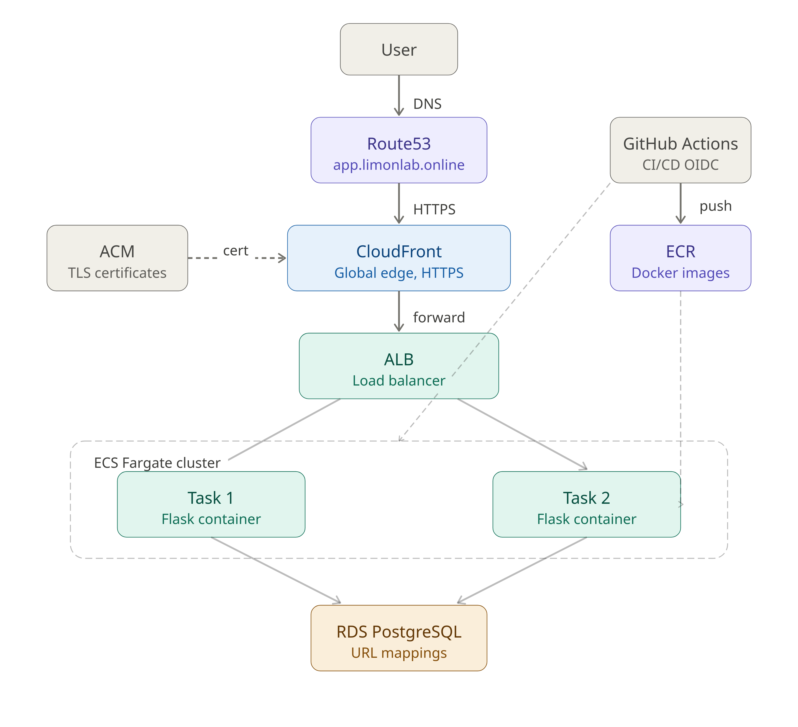

# URL Shortener — AWS Production Platform

A production-grade URL shortener built on AWS, evolved across three versions from a single EC2 instance to a fully containerized ECS Fargate platform with CloudFront edge delivery and automated CI/CD.

**Live:** https://app.limonlab.online

---

## Architecture — V3



### Components

| Layer | Service | Purpose |
|---|---|---|
| DNS | Route53 | Routes `app.limonlab.online` to CloudFront |
| CDN | CloudFront | Global edge delivery, HTTPS termination |
| Load Balancer | ALB | Distributes traffic across ECS tasks |
| Compute | ECS Fargate | Runs Flask containers — no EC2 to manage |
| Container Registry | ECR | Stores Docker images |
| Database | RDS PostgreSQL | Stores short URL mappings |
| Certificate | ACM | TLS certificates for ALB and CloudFront |
| Infrastructure | Terraform | All AWS resources defined as code |
| CI/CD | GitHub Actions + OIDC | Automated build and ECS deployment |

---

## How It Works

1. User visits `app.limonlab.online/abc123`
2. Route53 resolves to CloudFront distribution
3. CloudFront forwards request to ALB over HTTPS
4. ALB routes to a healthy ECS Fargate task
5. Flask queries RDS PostgreSQL for the short code
6. Returns 301 redirect to the original URL

---

## API

**Create a short URL**
```bash
curl -X POST https://app.limonlab.online/shorten \
  -H "Content-Type: application/json" \
  -d '{"url": "https://example.com"}'
```

**Use a short URL**
```bash
curl -L https://app.limonlab.online/<short_code>
```

**Health check**
```bash
curl https://app.limonlab.online/health
```

---

## CI/CD Pipeline

Push to `v3` branch with changes in `app/` triggers GitHub Actions:

1. Build Docker image and push to ECR with commit SHA tag
2. Fetch current ECS task definition
3. Update task definition with new image tag — register new revision
4. Call `ecs update-service` — ECS rolls out new tasks with zero downtime

Authentication uses OIDC — no AWS credentials stored in GitHub secrets.

---

## Infrastructure

All infrastructure is managed by Terraform in the `terraform/` directory.

```
terraform/
├── vpc.tf              # VPC, subnets, IGW, NAT Gateway
├── alb.tf              # Application Load Balancer, listeners, target group
├── ecs.tf              # ECS cluster, task definition, service
├── rds.tf              # RDS PostgreSQL instance
├── iam.tf              # ECS task execution role, task role
├── security_groups.tf  # ALB, ECS task, RDS security groups
├── cloudwatch.tf       # Log group for container logs
├── cloudfront.tf       # CloudFront distribution
├── acm.tf              # TLS certificates (eu-north-1 + us-east-1)
├── route53.tf          # DNS records
└── s3.tf               # Terraform remote state bucket
```

**Deploy:**
```bash
cd terraform
terraform init
terraform plan
terraform apply
```

---

## Version History

### V1 — Single EC2
Flask app on a single EC2 instance with RDS PostgreSQL, ALB, HTTPS, Route53, SSM for access. No containers. Infrastructure as code with Terraform.

### V2 — Containerized with ASG
Flask app Dockerized and deployed via ECR. EC2 Auto Scaling Group (min 2, max 4) with CPU and ALB request count scaling policies. GitHub Actions CI/CD using OIDC — builds image, pushes to ECR, deploys via SSM Run Command.

### V3 — ECS Fargate + CloudFront (current)
Replaced EC2/ASG with ECS Fargate — no EC2 instances to manage. Added CloudFront in front of ALB for edge delivery. Updated CI/CD to deploy by updating ECS task definition instead of SSM Run Command.

---

## Future Improvements

- **Secrets Manager** — move database credentials from environment variables to AWS Secrets Manager for proper secret management
- **ECS Auto Scaling** — add Application Auto Scaling based on CPU utilization and ALB request count to match V2 scaling behavior
- **GitHub OIDC role in Terraform** — currently created manually in console; should be managed as infrastructure code

---

## Stack

Python · Flask · PostgreSQL · Docker · Terraform · AWS (ECS Fargate · RDS · ALB · CloudFront · ECR · Route53 · ACM · CloudWatch · IAM)