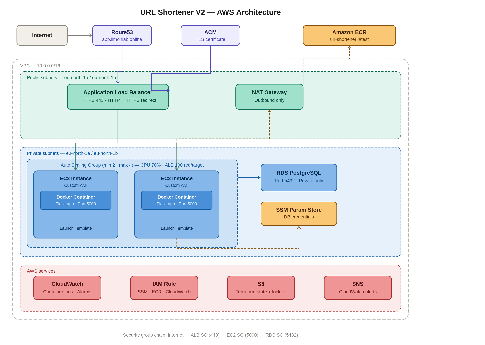

# URL Shortener — Production AWS Infrastructure

A production-grade URL shortener built on AWS, similar to bit.ly. Built in multiple versions as part of a hands-on DevOps portfolio.

## What it does

- `POST /shorten` — accepts a long URL, generates a 6-character short code, stores in PostgreSQL, returns the short URL
- `GET /<short_code>` — looks up the short code in the database and redirects the user to the original URL
- `GET /health` — health check endpoint for ALB

**Live:** `https://app.limonlab.online`

---

## Architecture — V2 (Current)



### What changed from V1 to V2

| | V1 | V2 |
|---|---|---|
| Compute | Single EC2 instance | ASG with 2–4 instances |
| App deployment | Flask via systemd, app.py from S3 | Flask in Docker container from ECR |
| Scaling | None | CPU-based (70%) + ALB request count (100 req/target) |
| Self-healing | None — single point of failure | ALB health checks → ASG replaces unhealthy instances |
| AMI | Public Amazon Linux 2023 | Custom AMI with Docker, SSM Agent, CloudWatch Agent pre-installed |
| Credentials | systemd EnvironmentFile | `docker run -e` injected from SSM at boot |

### Components

| Component | Purpose |
|-----------|---------|
| Route53 | Alias A record pointing `app.limonlab.online` to ALB |
| ACM | TLS certificate for HTTPS — same region as ALB (eu-north-1) |
| ALB | HTTPS termination, HTTP→HTTPS redirect, health checks |
| ASG | Auto scaling group — min 2, max 4 instances |
| EC2 | Runs Docker container from custom AMI — private subnet |
| ECR | Container registry — stores Flask Docker image |
| RDS PostgreSQL | URL storage in private subnet — never publicly accessible |
| NAT Gateway | Outbound internet for EC2 — ECR image pulls, SSM |
| SSM Parameter Store | Secure storage for DB credentials — no hardcoded secrets |
| CloudWatch | Container log collection from EC2, alarms |
| IAM Role | Least-privilege EC2 permissions (SSM, ECR, CloudWatch) |
| S3 | Terraform remote state (`use_lockfile = true`) |

### Security group chain

```
Internet → ALB SG (80/443) → EC2 SG (5000, source: ALB SG only) → RDS SG (5432, source: EC2 SG only)
```

EC2 has no public IP. RDS has no public access. Only SSM Session Manager for terminal access — no SSH, no bastion host.

---

## Architecture — V1 (Foundation)


Single EC2 instance behind ALB. Flask runs directly via systemd. App code fetched from S3 at boot. See `main` branch for V1 code.

---

## Tech stack

- **Infrastructure:** Terraform (modular file structure, S3 remote state)
- **Application:** Python 3, Flask, psycopg2
- **Container:** Docker, Amazon ECR
- **Database:** PostgreSQL 16 on RDS
- **Region:** eu-north-1 (Stockholm)
- **CI/CD:** GitHub Actions → ECR → SSM Run Command (OIDC authentication)

---

## Project structure

```
url-shortener/
├── app/
│   ├── app.py              # Flask application
│   ├── Dockerfile          # Container definition
│   └── requirements.txt    # Python dependencies
├── docs/
│   ├── architecture_v1.png
│   └── architecture_v2.png
└── terraform/
    ├── alb.tf
    ├── asg.tf
    ├── backend.tf
    ├── cloudwatch.tf
    ├── ec2.tf
    ├── iam.tf
    ├── outputs.tf
    ├── providers.tf
    ├── rds.tf
    ├── route53.tf
    ├── s3.tf
    ├── security_groups.tf
    ├── ssm.tf
    ├── terraform.tfvars
    └── user_data.sh
├── .github/
    └── workflows/
       └── deploy.yml      # CI/CD pipeline
```

---

## Deploy

### Prerequisites
- AWS CLI configured with profile `limonlab`
- Terraform >= 1.10
- Docker
- Domain hosted in Route53
- Custom AMI built with Docker, SSM Agent, CloudWatch Agent installed
- ECR repository created (`url-shortener`)

### Steps

```bash
# 1. Build and push Docker image to ECR
cd app
docker build -t url-shortener .
aws ecr get-login-password --region eu-north-1 | docker login --username AWS --password-stdin 688600819246.dkr.ecr.eu-north-1.amazonaws.com
docker tag url-shortener:latest 688600819246.dkr.ecr.eu-north-1.amazonaws.com/url-shortener:latest
docker push 688600819246.dkr.ecr.eu-north-1.amazonaws.com/url-shortener:latest

# 2. Deploy infrastructure
cd ../terraform
terraform init
terraform apply
```

### Required variables (terraform.tfvars)

```hcl
ami_id        = "ami-xxxxxxxxx"   # Custom AMI ID
db_username   = "dbadmin"
db_password   = "yourpassword"
```

---

## Test

```bash
# Health check
curl https://app.limonlab.online/health

# Shorten a URL
curl -X POST https://app.limonlab.online/shorten \
  -H "Content-Type: application/json" \
  -d '{"url": "https://www.google.com"}'

# Test redirect — open in browser
# Copy short_code from response and visit:
# https://app.limonlab.online/<short_code>
```

---

## Key lessons learned

- `aws_launch_template` requires `base64encode()` for user_data — unlike `aws_instance`, Terraform does not encode it automatically
- EC2 uses IAM instance role for AWS CLI authentication — no `--profile` flag needed, credentials fetched from IMDS automatically
- `health_check_type = "ELB"` is critical — without it ASG won't replace instances where the app is broken but EC2 is still running
- `desired_capacity` omitted when using scaling policies — avoids Terraform fighting policy-driven scaling on every apply
- Docker layer order matters — `COPY requirements.txt` + `RUN pip install` before `COPY . .` prevents reinstalling dependencies on every app code change
- `set -e` in user_data stops the entire script on first error — prevents Docker from running with missing credentials
- Instance refresh required after user_data changes — existing instances are not affected, only new launches pick up updated user_data

---

## Break/fix scenarios completed

| Scenario | What was broken | What happened | Fix |
|----------|----------------|---------------|-----|
| Wrong SSM parameter name | `db_host` → `db_hos` in user_data.sh | `set -e` exited script, Docker never started, ALB marked instance unhealthy, ASG terminated and replaced | Restored correct parameter name, terraform apply, instance refresh |
| Docker stopped on live instance | `systemctl stop docker && docker.socket` via SSM | Flask container died, ALB health check failed, instance drained and terminated, ASG launched fresh replacement — zero downtime | Self-healed automatically |

---

## Versions

- **V1** (`main` branch) — Foundation: Route53/ALB/EC2/RDS/Terraform/systemd
- **V2** (`v2` branch) — Docker, ECR, ASG, auto scaling, self-healing
- **V3 (planned)** — ECS Fargate, ElastiCache Redis, CloudFront