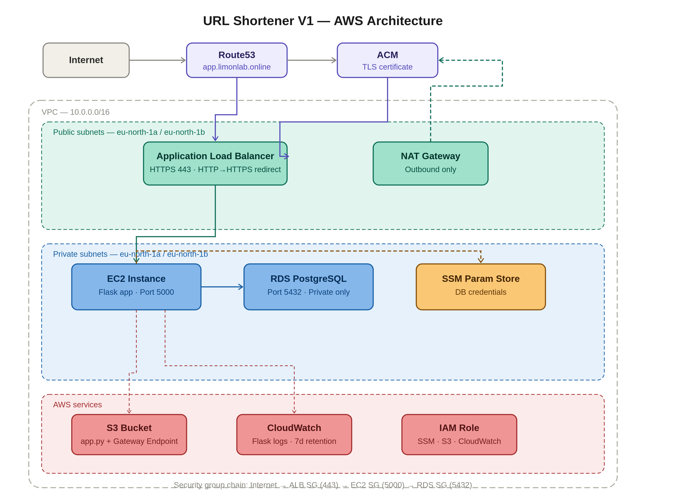

# URL Shortener — Production AWS Infrastructure

A production-grade URL shortener built on AWS, similar to bit.ly. Built in three versions as part of a hands-on DevOps portfolio.

## What it does

- `POST /shorten` — accepts a long URL, generates a 6-character short code, stores in PostgreSQL, returns the short URL
- `GET /<short_code>` — looks up the short code in the database and redirects the user to the original URL
- `GET /health` — health check endpoint for ALB

**Live:** `https://app.limonlab.online`

---

## Architecture — V1 (Foundation)





### Components

| Component | Purpose |
|-----------|---------|
| Route53 | Alias A record pointing `app.limonlab.online` to ALB |
| ACM | TLS certificate for HTTPS — same region as ALB (eu-north-1) |
| ALB | HTTPS termination, HTTP→HTTPS redirect, health checks |
| EC2 (t3.micro) | Flask application server in private subnet |
| RDS PostgreSQL | URL storage in private subnet — never publicly accessible |
| NAT Gateway | Outbound internet for EC2 (SSM, package installs) |
| SSM Parameter Store | Secure storage for DB credentials — no hardcoded secrets |
| S3 + Gateway Endpoint | App code storage — traffic stays inside AWS network |
| CloudWatch | Flask application log shipping from EC2 |
| IAM Role | Least-privilege EC2 permissions (SSM, S3, CloudWatch) |

### Security group chain

```
Internet → ALB SG (80/443) → EC2 SG (5000, source: ALB SG only) → RDS SG (5432, source: EC2 SG only)
```

EC2 has no public IP. RDS has no public access. Only SSM Session Manager for terminal access — no SSH, no bastion host.

---

## Tech stack

- **Infrastructure:** Terraform (modular file structure, S3 remote state)
- **Application:** Python 3, Flask, psycopg2
- **Database:** PostgreSQL 16 on RDS
- **CI/CD:** GitHub Actions (V2)
- **Region:** eu-north-1 (Stockholm)

---

## Project structure

```
url-shortener/
├── providers.tf
├── backend.tf
├── variables.tf
├── outputs.tf
├── vpc.tf               # VPC, subnets, IGW, NAT, route tables
├── security_groups.tf   # ALB, EC2, RDS security groups
├── alb.tf               # ALB, target group, listeners
├── acm.tf               # ACM certificate
├── route53.tf           # DNS records, cert validation
├── ec2.tf               # EC2, IAM role, instance profile
├── rds.tf               # RDS instance, subnet group
├── ssm.tf               # SSM parameters for DB credentials
├── s3.tf                # S3 bucket, VPC gateway endpoint
├── cloudwatch.tf        # Log group with retention policy
├── user_data.sh         # EC2 bootstrap script
└── app/
    └── app.py           # Flask application
```

---

## Deploy

### Prerequisites
- AWS CLI configured with profile `limonlab`
- Terraform >= 1.0
- Domain in Route53

### Steps

```bash
# 1. Create S3 bucket first (app.py needs it before EC2 boots)
terraform init
terraform apply -target=aws_s3_bucket.project_bucket

# 2. Upload app code
aws s3 cp app/app.py s3://urlshortener-s3-bucket/app.py --profile limonlab

# 3. Deploy everything
terraform apply
```

### Required variables (terraform.tfvars)

```hcl
ami_id      = "ami-xxxxxxxxx"   # Amazon Linux 2023 in eu-north-1
db_username = "dbadmin"
db_password = "yourpassword"
```

---

## Test

```bash
# Health check
curl https://app.limonlab.online/health

# Shorten a URL
curl -X POST https://app.limonlab.online/shorten \
  -H "Content-Type: application/json" \
  -d '{"url": "https://www.google.com"}'

# Test redirect (use short_code from above response)
curl -L https://app.limonlab.online/<short_code>
```

---

## Key lessons learned

- ACM certificate must be in the **same region as ALB** — not us-east-1 (that is only for CloudFront)
- EC2 `depends_on` NAT Gateway — user data runs at boot and needs outbound internet
- SSM Parameter Store for secrets — no credentials in code or environment files
- `CREATE TABLE IF NOT EXISTS` — safe to run on every boot, idempotent
- S3 Gateway Endpoint — S3 traffic stays inside AWS network, avoids NAT Gateway charges
- CloudWatch log group defined in Terraform — controls retention, avoids orphaned log groups with no expiry

---

## Break/fix scenarios completed

| Scenario | How to reproduce | Diagnosis |
|----------|-----------------|-----------|
| RDS unreachable | Remove EC2→RDS inbound rule from RDS SG | CloudWatch shows `Connection timed out` on port 5432. ALB returns 504. Fix: restore SG rule. |

---

## Versions

- **V1 (current)** — Foundation: Route53/ALB/EC2/RDS/Terraform
- **V2 (planned)** — ASG, GitHub Actions CI/CD, blue/green deployments
- **V3 (planned)** — ECS Fargate, ElastiCache Redis, CloudFront